### Latest Blog Posts

<!-- BLOG-POST-LIST:START -->
- [微积分课程笔记](https://leojhonsong.github.io/zh-CN/2022/09/27/%E5%BE%AE%E7%A7%AF%E5%88%86%E8%AF%BE%E7%A8%8B%E7%AC%94%E8%AE%B0/)
- [探海利器-声呐课程笔记](https://leojhonsong.github.io/zh-CN/2022/05/23/%E6%8E%A2%E6%B5%B7%E5%88%A9%E5%99%A8-%E5%A3%B0%E5%91%90%E8%AF%BE%E7%A8%8B%E7%AC%94%E8%AE%B0/)
- [2022年5月15日 版本控制与敏捷项目管理分享](https://leojhonsong.github.io/zh-CN/2022/05/23/2022%E5%B9%B45%E6%9C%8815%E6%97%A5%E7%89%88%E6%9C%AC%E6%8E%A7%E5%88%B6%E4%B8%8E%E6%95%8F%E6%8D%B7%E9%A1%B9%E7%9B%AE%E7%AE%A1%E7%90%86%E5%88%86%E4%BA%AB/)
- [LaTeX杂记](https://leojhonsong.github.io/zh-CN/2021/04/24/LaTeX%E6%9D%82%E8%AE%B0/)
- [初级急救员笔记](https://leojhonsong.github.io/zh-CN/2021/01/21/%E5%88%9D%E7%BA%A7%E6%80%A5%E6%95%91%E5%91%98%E7%AC%94%E8%AE%B0/)
<!-- BLOG-POST-LIST:END -->

